  

  

  
  &nbsp;
  
  &nbsp;
  

---

### ⚡ Engineering Focus &amp; Core Philosophy

I engineer software that balances **speed, deterministic architecture, and user intuition**. My work spans two primary disciplines:

- **Full-Stack Web Systems:** Architecting responsive, type-safe web platforms using **Next.js, React, and TypeScript** with a focus on modular component design, state predictability, and optimal Core Web Vitals.
- **Automation &amp; Media Engineering:** Developing high-throughput utilities in **Python** (leveraging **FFmpeg, yt-dlp, and OpenAI Whisper**) that transform hours of manual asset processing into zero-friction automated pipelines.

---

# 🚀 Flagship Systems &amp; Architectures

> *Note: Commercial, client, and internal systems are showcased by technical scope and architecture (source code is maintained in private repositories).*

<table>
  <tr>
    <td width="50%" valign="top">
      <h3>💼 Small Business Bookkeeping Dashboard</h3>
      
<b>Architecture:</b> Standalone Offline-First Web Application 
      <b>Role:</b> Solo Architect &amp; Developer

      
A zero-dependency financial ledger designed to operate 100% client-side in the browser. Guarantees complete data sovereignty and zero server latency for daily small-business transaction auditing.

      <ul>
        <li><b>Offline-First Engine:</b> Local state persistence engine with real-time balance reconciliation.</li>
        <li><b>Deterministic Math:</b> Zero floating-point drift across income and expense categories.</li>
        <li><b>Zero-Dependency:</b> Packaged into a self-contained single-file bundle with instant cold-start time.</li>
      </ul>
      

        
        
      

    </td>
    <td width="50%" valign="top">
      <h3>🛒 Digital License &amp; Reseller Storefront</h3>
      
<b>Architecture:</b> Mobile-First E-Commerce &amp; Provisioning Engine 
      <b>Role:</b> Full-Stack Lead

      
A high-performance digital goods storefront built to automate software license distribution, AI subscription fulfillment, and real-time catalog sync via external reseller APIs.

      <ul>
        <li><b>API Orchestration:</b> Automated webhook and REST handshake with the SafwanTiger API.</li>
        <li><b>Next.js SSR:</b> Sub-second page loads, dynamic caching, and mobile-optimized checkout.</li>
        <li><b>Type-Safe Contracts:</b> End-to-end TypeScript interfaces guaranteeing request integrity.</li>
      </ul>
      

        
        
      

    </td>
  </tr>
  <tr>
    <td width="50%" valign="top">
      <h3>🎬 VideoForge Media Repurposing Suite</h3>
      
<b>Architecture:</b> Desktop Automation &amp; AI Transcription 
      <b>Role:</b> Systems Author

      
An automated multimedia repurposing engine designed to ingest long-form media, perform AI speech-to-text recognition, and generate vertical clips with burnt-in animated captions.

      <ul>
        <li><b>FFmpeg Chaining:</b> Automated 16:9 to 9:16 aspect ratio cropping and filter compilation.</li>
        <li><b>Whisper Speech AI:</b> Frame-accurate subtitle alignment and timestamp generation.</li>
        <li><b>Workflow Automation:</b> Decreased post-production turnaround by over 80%.</li>
      </ul>
      

        
        
      

    </td>
    <td width="50%" valign="top">
      <h3>⚡ UltraFetch Stream Extraction Engine</h3>
      
<b>Architecture:</b> High-Throughput Stream Pipeline 
      <b>Role:</b> Solo Author

      
A resilient Python CLI engine built for automated stream extraction, chunked media downloading, and programmatic asset routing with automated error recovery.

      <ul>
        <li><b>Resilient Chunking:</b> Dynamic retry logic and stream reconnection handling.</li>
        <li><b>Batch CLI Workflow:</b> Automated target directory routing and batch manifest ingestion.</li>
        <li><b>Integrity Verification:</b> Real-time checksum and payload size verification.</li>
      </ul>
      

        
        
      

    </td>
  </tr>
</table>

---

# 🧰 Technical Competency &amp; Tooling

  

    
  

  
  
  
  
  
  

---

# 📈 Contribution Activity

  

---

# 🤝 Open to Engineering Opportunities &amp; Collaboration

I am available for full-time engineering roles, technical contract work, and ambitious collaborations in **Full-Stack Web Engineering (Next.js / TypeScript), UI Systems, and Python Automation**.

  
  &nbsp;
  
  &nbsp;
  

 

  Engineered with precision by Sabih Ullah • Building resilient software from concept to production

