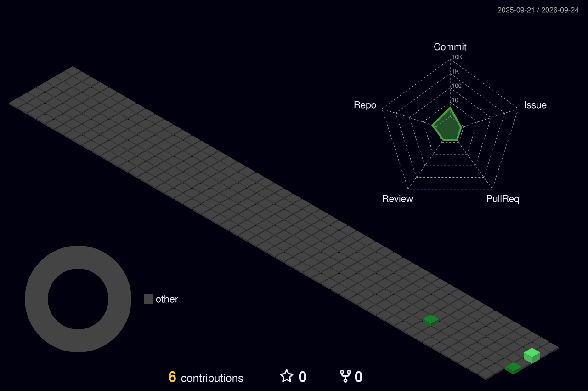

  

  

  
  
  

 

## 👋 About Me

I’m a **Full-Stack Web Developer** from Charsadda, Pakistan, specializing in **modern web architectures, type-safe full-stack engineering, and programmatic automation**. I design and develop responsive frontend applications, high-utility business dashboards, and automated toolsets.

**Current focus:** Production-ready web systems, Next.js &amp; React storefronts, offline-first client architecture, and Python/FFmpeg automation pipelines.

---

# 🚀 Selected Systems &amp; Engineering Work

> *Note: Proprietary, commercial, and internal client projects are highlighted by architecture and technical scope (source code is maintained in private repositories).*

## 💼 Small Business Bookkeeping Dashboard

**Architecture: Standalone Offline-First Web Application · Solo Developer**

A zero-dependency small-business financial management system engineered to run entirely offline inside the client’s browser with zero server latency and complete data privacy.

- Designed an **offline-first local persistence architecture** storing all ledger and transaction states securely in the browser
- Built deterministic financial calculations for income categorization, recurring expense tracking, and dynamic cash-flow balances
- Crafted a clean, dark-mode responsive UI packaged into a lightweight, zero-dependency deployment
- Implemented client-side reporting views and summary exports for frictionless daily bookkeeping

  
  
  

 

## 🛒 Digital License &amp; Services Storefront

**Full-Stack E-Commerce &amp; Reseller Platform · Next.js · TypeScript**

A mobile-first storefront engineered for automated digital product distribution, license delivery, and third-party subscription fulfillment via external API integrations.

- Engineered with **Next.js and TypeScript** for server-rendered speed, strong type safety, and optimal mobile UX
- Integrated external REST APIs (**SafwanTiger Reseller API**) for automated catalog synchronization and account fulfillment
- Designed responsive product showcases, tiered subscription selectors, and automated checkout handshakes
- Implemented secure API request authentication, payload validation, and client-side state caching

  
  
  

 

## 🎬 Video Repurposing &amp; Automation Suite

**Desktop Automation Utility · Python · FFmpeg · OpenAI Whisper · yt-dlp**

A specialized local media repurposing engine designed to ingest long-form video content, perform automated speech recognition, and generate short-form clips with burnt-in captions.

- Integrated **yt-dlp** for programmatic multi-source media acquisition with fallback format handlers
- Automated speech-to-text generation and timestamped subtitle alignment using **OpenAI Whisper**
- Built **FFmpeg** processing pipelines for automated video cropping (16:9 to 9:16 vertical), filter chaining, and clip slicing
- Reduced manual editing time by over 80% through deterministic CLI-driven workflow automation

  
  
  

 

## ⚡ UltraFetch — Stream Extraction Utility

**Media Extraction Script · Python CLI**

A command-line automated extraction utility engineered for robust stream retrieval, resilient chunk downloads, and automated media file organization.

- Designed streaming chunk download pipelines with automatic retry algorithms and network timeout resilience
- Implemented batch URL parsing, format selection, and structured local directory routing
- Built real-time CLI progress monitoring tracking download speeds, bytes transferred, and payload integrity

  
  
  

 

### Additional Domain Utilities &amp; Systems

- **Shift Worker Weekly Planner** — Interactive scheduling and shift allocation application built for dynamic roster planning.
- **Wedding &amp; Event Budget Planner** — Client-side budget estimation tool with category-based expense distribution.
- **Media Clipping Software** — Local helper application for rapid asset trimming and segmentation.

---

# 🧰 Core Engineering Stack

### Languages &amp; Core Web

<table>
<tr>
<td align="center" width="130"> <b>TypeScript</b></td>
<td align="center" width="130"> <b>JavaScript</b></td>
<td align="center" width="130"> <b>Python 3</b></td>
<td align="center" width="130"> <b>HTML5</b></td>
<td align="center" width="130"> <b>CSS3</b></td>
<td align="center" width="130"> <b>Git</b></td>
</tr>
</table>

### Frameworks, Libraries &amp; Tools

<table>
<tr>
<td align="center" width="130"> <b>React</b></td>
<td align="center" width="130"> <b>Next.js</b></td>
<td align="center" width="130"> <b>Tailwind CSS</b></td>
<td align="center" width="130"> <b>Node.js</b></td>
<td align="center" width="130"> <b>VS Code</b></td>
<td align="center" width="130"> <b>Postman</b></td>
</tr>
</table>

  
  
  
  
  
  

<b>Additional technologies &amp; methodologies</b>

 
TypeScript · JavaScript (ES6+) · React · Next.js · Tailwind CSS · Node.js · Express · Python 3 · FFmpeg · yt-dlp · OpenAI Whisper · RESTful APIs · Offline-First Architecture · Git Version Control · GitHub · Postman · Linux CLI

---

# 📊 Engineering Activity &amp; 3D Contribution Calendar

  

 

  
  &nbsp;&nbsp;
  

---

# 🤝 Open to Engineering Opportunities &amp; Collaboration

I’m actively looking for opportunities and projects involving **Full-Stack Web Development, Next.js / TypeScript Architecture, and Python Media &amp; Workflow Automation**.

  
  
  

 

  Full-Stack Web Engineering • Automation • Clean Architecture

